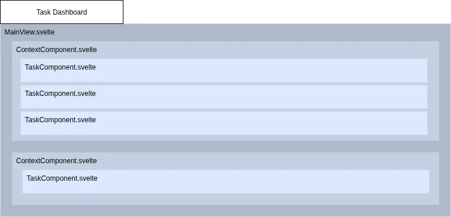

# UI components

This project uses [Svelte](https://svelte.dev/) for the user interface.
Following the recommendation in the [Obsidian documentation](https://docs.obsidian.md/Plugins/Getting+started/Use+Svelte+in+your+plugin),
Svelte was selected because it is lightweight and well suited to the needs of this plugin.

This document provides an overview of the current UI components and describes how they are organized.

## Hierarchy

The component hierarchy is shown in the following screenshot:

- `MainView`: The main view of the plugin. It renders the full content of the **Task Dashboard** tab.
- `ContextComponent`: Displays and manages the tasks associated with a specific context.
- `TaskComponent`: Represents an individual task entry.

## Additional components

The plugin also uses the following supporting components:

- `ErrorComponent`: Displays error messages in `MainView`, such as when the server cannot be reached or another issue occurs.
- `SpinnerComponent`: Displays a loading state. It includes a spinner and a placeholder message for the user.

